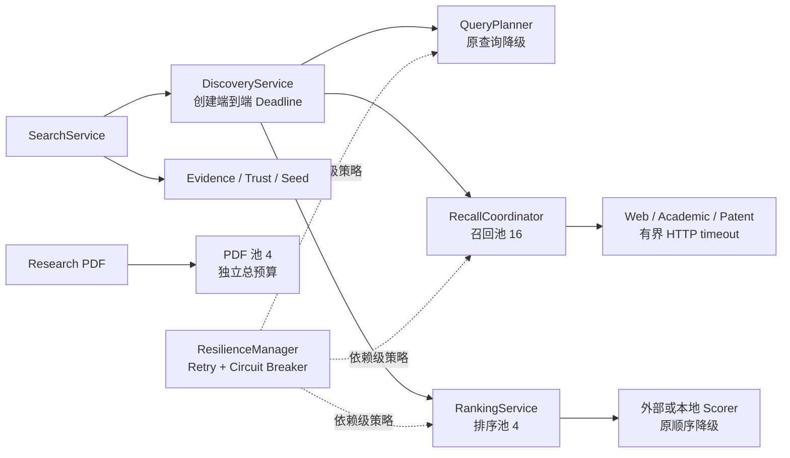

# Agent Search 稳定性提升总结

> 状态：已实现并通过当前工作树验收
> 汇总日期：2026-07-28
> 范围：搜索规划、Provider 召回、重排、PDF 富化、公开失败契约、质量门槛与 20/50 并发门槛

## 1. 总结

本轮稳定性改造不再把“稳定”理解成单纯增加超时，而是建立了四层相互约束的机制：

1. **时间预算**：一次搜索只有一个端到端 Deadline，各阶段和外部 HTTP 调用消费同一份剩余预算。
2. **资源隔离**：召回、重排和 PDF 富化使用独立且有上限的线程池，慢任务不能占满其他阶段的执行槽位。
3. **故障韧性**：可恢复错误执行有界重试；连续最终失败触发依赖级熔断；无法恢复时按明确矩阵降级。
4. **发布门槛**：固定语料锁定排序质量，20/50 并发负载锁定成功率、Deadline、重试恢复、延迟和隔离池上限。

最终效果是：单一依赖变慢或失败时，系统会在限定时间内返回可解释的完整或部分结果，而不是无限等待、线程池相互拖垮或让 Agent 猜测下一步动作。

## 2. 整体结构



`DiscoveryService` 创建的 Deadline 会向 QueryPlanner、RecallCoordinator 和 RankingService 传播；各外部依赖拥有独立熔断状态，但共享同一套韧性规则。

## 3. 超时：从分散超时改为端到端预算

### 3.1 单一 Deadline

`Deadline` 基于注入的 monotonic clock 计算，不受系统时间回拨影响。默认搜索总预算由 `SEARCH_DEADLINE_MS=30000` 控制。

各阶段的行为如下：

- Query rewrite 在调用前读取剩余预算；预算耗尽则跳过改写并使用原查询。
- Recall 把单源超时限制为 `min(SEARCH_PROVIDER_TIMEOUT, deadline.remaining)`。
- Recall 等待并发任务时只等待剩余预算；超时后取消尚未开始的 future，并为未完成来源返回 `SEARCH_DEADLINE_EXCEEDED`。
- Ranking 将剩余预算传给支持 timeout 的 scorer；超时或异常时按来源域回退为未重排结果。
- PDF 富化使用自己的总预算，同时受上层 Deadline 限制。

### 3.2 HTTP 总超时

Provider、SiliconFlow query rewrite 和 SiliconFlow reranker 统一使用 `bounded_http_timeout()`。它构造 `urllib3.Timeout(total=..., connect=...)`，避免 `requests` 标量 timeout 分别作用于连接和读取、导致一次 HTTP 交换的真实耗时超过预期。

这意味着外部调用的有效上限始终为：

```text
effective_timeout = min(adapter_configured_timeout, request_remaining_budget)
```

### 3.3 Deadline 语义

Deadline 耗尽属于本次请求预算不足，不计入依赖熔断。公开 failure 的 `retry_owner=caller`，表示只有调用方愿意扩大预算或减少工作量时，重试才有意义。

## 4. 隔离：慢任务不再共享同一个执行池

运行时建立三个独立线程池：

| 工作负载 | 默认 worker | 配置 | 隔离目的 |
|---|---:|---|---|
| Provider 召回 | 16 | `EXECUTOR_MAX_WORKERS` | 多源 I/O 并发，不被模型或 PDF 占用 |
| Web/Academic/Patent 重排 | 4 | `RANKING_EXECUTOR_MAX_WORKERS` | 慢 scorer 不消耗召回槽位 |
| PDF 下载与富化 | 4 | `PDF_EXECUTOR_MAX_WORKERS` | 大文件和解析任务不阻塞搜索主链路 |

Container 统一拥有并关闭 HTTP session、线程池、scorer、store 和 dispatcher；正常 lifespan 结束与构建中途失败都执行受管资源回收，减少线程与连接泄漏。

此外：

- scorer cache 使用锁保证并发下同一配置只构造一个实例；
- query rewrite cache 与 provider cache 使用线程安全的有界 LRU+TTL；
- 时效查询跳过 provider cache，避免稳定性优化牺牲新鲜度。

## 5. 重试：只重试明确可恢复的外部错误

统一 `ResilienceManager` 已接入：

- Web、Academic、Patent Provider recall；
- 普通与学术 query rewrite；
- 外部 reranker/scorer。

默认策略：

| 参数 | 默认值 | 含义 |
|---|---:|---|
| `RESILIENCE_MAX_ATTEMPTS` | 2 | 总尝试次数，包含首次调用 |
| `RESILIENCE_BACKOFF_BASE_MS` | 100 ms | 指数退避基础值 |
| `RESILIENCE_BACKOFF_MAX_MS` | 1000 ms | 单次退避上限 |

规则：

- 仅重试 `ExternalServiceError(recoverable=true)`。
- timeout、HTTP 429、HTTP 5xx 和受控的无效响应属于可恢复错误。
- HTTP 401/403 和其他明确的 HTTP 4xx 请求拒绝不可恢复，不重试。
- 退避采用指数增长和 jitter。
- 上游提供 `Retry-After` 时，等待时间取退避值与 `Retry-After` 的较大者。
- 如果等待后会越过当前请求 Deadline，则不再重试，直接保留最后一个真实错误。

默认只增加一次重试，目的是恢复短暂抖动，同时限制重试风暴和尾延迟放大。

## 6. 熔断：按依赖隔离故障

Provider、query rewrite 和 scorer 使用不同 dependency key，因此一个依赖打开熔断不会阻断其他来源。

默认状态机：

```text
closed --连续 3 次最终可恢复失败--> open
open --等待 30 秒--> half-open
half-open --单探针成功--> closed
half-open --探针失败--> open
```

对应配置：

| 参数 | 默认值 |
|---|---:|
| `CIRCUIT_FAILURE_THRESHOLD` | 3 |
| `CIRCUIT_OPEN_SECONDS` | 30 秒 |

关键约束：

- 只有“重试已耗尽的可恢复失败”累计熔断失败数。
- 不可恢复错误和请求自身 Deadline 不污染依赖健康状态。
- half-open 同一时间只允许一个探针，其他调用快速返回。
- 熔断拒绝使用稳定错误码 `CIRCUIT_OPEN`，并返回 `retry_after_ms`。
- `snapshot()` 提供 calls、retries、successes、failures、circuit_rejections、deadline_exhausted 和熔断状态，供诊断和后续指标接入。

## 7. 明确的公开降级矩阵

公开 `search.v1` failure 新增：

- `retryable`
- `retry_after_ms`
- `degradation.action`
- `degradation.impact`
- `degradation.retry_owner`

完整降级矩阵：

| Stage | 典型失败 | 降级动作 | 影响 | retry_owner |
|---|---|---|---|---|
| `query_rewrite` | timeout / 429 / circuit open | `use_original_query` | quality | server |
| `academic_query_rewrite` | timeout / 429 / circuit open | `use_original_query` | quality | server |
| `routing` | Provider 未启用 | `continue_available_sources` | coverage | none |
| `provider_search` | timeout / 5xx / circuit open | `continue_available_sources` | coverage | server |
| `provider_search` | 请求 Deadline 耗尽 | `continue_available_sources` | coverage | caller |
| `rerank` | timeout / 5xx / circuit open | `use_unreranked_results` | quality | server |
| `seed_store` | SQLite 暂不可用 | `omit_research_seed` | feature | caller |
| `pdf_enrichment` | 下载或解析失败 | `use_abstract_or_metadata` | quality | server |
| `claim_entailment` | 外部模型失败 | `use_rule_verification` | quality | server |

`retry_owner` 的含义：

- `server`：服务端负责重试与熔断恢复，Agent 应先使用当前降级结果。
- `caller`：只有调用方改变 Deadline 或确实需要缺失能力时才应再次请求。
- `none`：重试无法解决，需要配置、能力或输入变化。

回答决策仍以 `retrieval_assessment.status` 与 `gaps[]` 为准。单个 Provider 失败不再等同于整次搜索失败；SearchService 会保留其他来源的证据并把响应标为 `partial`。

## 8. 外部错误边界与脱敏

HTTP 客户端异常统一映射为稳定的 `ExternalServiceError(provider, code, recoverable, retry_after)`：

- 公共错误不返回第三方响应体、header、完整 URL 查询参数或底层异常文本；
- Bearer token、API key、secret 和 URL credentials 会在边界处脱敏；
- 未知内部异常只返回稳定说明，原始 cause 仅供受控服务端诊断；
- REST 与 MCP 通过同一 `search.v1` 模型得到一致的失败和降级字段。

这避免了稳定性诊断机制反过来成为凭证和上游数据泄漏通道。

## 9. 质量 Golden Gate

固定语料位于 `eval/golden/quality_corpus.json`：

- Web、Academic、Patent 各 3 条查询，共 9 条；
- 每条查询包含 5 个固定候选及 0–3 级相关性；
- 使用三个生产领域排序策略和确定性 token-overlap scorer；
- 计算 NDCG@5、Recall@5、Precision@5 和 MRR；
- 分别检查 overall、web、academic、patent。

保护规则：

- corpus SHA-256 必须与审定基线一致，防止语料被静默替换；
- 任一领域的任一指标比基线绝对下降超过 0.02 即失败；
- 更新语料或有意改变排序策略时，必须显式更新并评审基线。

当前基线：

| Track | NDCG@5 | Recall@5 | Precision@5 | MRR |
|---|---:|---:|---:|---:|
| Overall | 0.9755 | 1.0000 | 0.4000 | 1.0000 |
| Web | 0.9975 | 1.0000 | 0.4000 | 1.0000 |
| Academic | 0.9383 | 1.0000 | 0.4000 | 1.0000 |
| Patent | 0.9907 | 1.0000 | 0.4000 | 1.0000 |

这里的目标是锁定排序策略和特征组合的确定性行为；真实 provider 与模型效果仍由完整 IR/Agent 评测覆盖。

## 10. 20/50 并发稳定性门槛

并发门槛运行真实的：

```text
QueryPlanner
  → RecallCoordinator
  → RankingService
  → EvidenceAssembler
  → TrustAnnotator
  → SQLite Search Seed Store
```

只有公网 Provider 和 scorer 被替换为带确定延迟的受控实现，因此测试不访问公网、不消耗第三方配额。

默认负载：

| Client 并发 | 请求数 | Provider 延迟 | Scorer 延迟 | 瞬时故障 | Deadline |
|---:|---:|---:|---:|---:|---:|
| 20 | 40 | 20 ms | 5 ms | 每 10 个请求首次失败 1 次 | 1500 ms |
| 50 | 100 | 20 ms | 5 ms | 每 10 个请求首次失败 1 次 | 1500 ms |

阻断条件包括：

- success、complete、usable、retry recovery rate 必须为 100%；
- exception rate 和 Deadline failure rate 必须为 0；
- 20/50 并发的 P95 分别不得超过 1000/1500 ms；
- 吞吐不得低于 20 requests/s；
- 召回并行度不得超过 16，排序并行度不得超过 4；
- resilience retry 计数必须与注入的瞬时失败数一致。

最近一次验收结果：

| 并发 | 请求数 | P95 | 吞吐 | 完整/可用 | 重试恢复 | 池峰值 |
|---:|---:|---:|---:|---:|---:|---:|
| 20 | 40 | 235.8 ms | 91.1 req/s | 100% | 4/4 | recall 16 / ranking 4 |
| 50 | 100 | 430.5 ms | 121.8 req/s | 100% | 10/10 | recall 16 / ranking 4 |

两档负载的异常率与 Deadline 失败率均为 0，两个隔离池均未突破配置上限。

## 11. 自动化验证与执行方式

一键执行全部门槛：

```bash
.venv311/bin/python -m eval.run_stability_gates
```

分别执行：

```bash
.venv311/bin/python -m eval.quality_golden_gate
.venv311/bin/python -m eval.concurrency_gate
```

有意更新质量基线：

```bash
.venv311/bin/python -m eval.quality_golden_gate --update-baseline
```

全量回归：

```bash
.venv311/bin/python -m pytest -q
```

运行时可通过 health 响应查看依赖状态与累计计数：

```bash
curl -s http://localhost:8000/health | jq '.resilience'
```

当前验收结果为 **190 passed**。主要保护测试：

- `tests/test_runtime_boundaries.py`：Deadline 传播、HTTP 总超时、线程安全 cache、pending future 取消和 scorer timeout。
- `tests/test_resilience.py`：重试、Retry-After、熔断、half-open、Deadline、公开 failure 与降级矩阵。
- `tests/test_stability_gates.py`：质量回退检测、20/50 两档负载和阈值回退检测。

GitHub Actions 工作流 `.github/workflows/stability-gates.yml` 在 push 和 pull request 上运行全量测试及两类稳定性门槛，并上传本次报告 artifact。

## 12. 关键配置汇总

| 环境变量 | 默认值 | 作用 |
|---|---:|---|
| `SEARCH_DEADLINE_MS` | 30000 | 单次搜索端到端预算 |
| `SEARCH_PROVIDER_TIMEOUT` | 15 | 单 Provider 配置超时，仍受剩余 Deadline 限制 |
| `EXECUTOR_MAX_WORKERS` | 16 | Provider 召回线程池 |
| `RANKING_EXECUTOR_MAX_WORKERS` | 4 | 独立重排线程池 |
| `PDF_EXECUTOR_MAX_WORKERS` | 4 | 独立 PDF 富化线程池 |
| `RESILIENCE_MAX_ATTEMPTS` | 2 | 可恢复错误总尝试次数 |
| `RESILIENCE_BACKOFF_BASE_MS` | 100 | 退避基础值 |
| `RESILIENCE_BACKOFF_MAX_MS` | 1000 | 退避上限 |
| `CIRCUIT_FAILURE_THRESHOLD` | 3 | 打开熔断前的连续最终失败数 |
| `CIRCUIT_OPEN_SECONDS` | 30 | open 状态保持时间 |

调参原则：

- 先确定用户可接受的端到端 Deadline，再分配 Provider、rewrite、ranking 和 PDF 子预算。
- 不要通过无限增加 worker 掩盖慢依赖，应结合依赖并发限制和目标实例资源调整。
- 重试次数保持小值；外部 429 应尊重 `Retry-After`，并依靠熔断避免持续放大流量。
- P95、Deadline failure、retry、circuit rejection、partial rate 和线程池饱和度应作为一组指标观察。

## 13. 代码与文档索引

| 位置 | 职责 |
|---|---|
| [`src/application/ports/runtime.py`](../src/application/ports/runtime.py) | Clock、Deadline 与 DeadlineExceededError |
| [`src/infrastructure/http_timeout.py`](../src/infrastructure/http_timeout.py) | 受剩余预算限制的 HTTP total timeout |
| [`src/infrastructure/resilience.py`](../src/infrastructure/resilience.py) | 有界重试、熔断状态机和诊断计数 |
| [`src/application/degradation.py`](../src/application/degradation.py) | 公开降级矩阵 |
| [`src/application/recall.py`](../src/application/recall.py) | Recall Deadline、任务取消和 Provider 韧性接入 |
| [`src/application/ranking_service.py`](../src/application/ranking_service.py) | 独立排序池、scorer Deadline、重试和来源域回退 |
| [`src/bootstrap.py`](../src/bootstrap.py) | 三类隔离池、共享 ResilienceManager 和资源生命周期 |
| [`eval/quality_golden_gate.py`](../eval/quality_golden_gate.py) | 固定语料质量门槛 |
| [`eval/concurrency_gate.py`](../eval/concurrency_gate.py) | 20/50 并发门槛 |
| [`eval/run_stability_gates.py`](../eval/run_stability_gates.py) | 一键执行稳定性门槛 |
| [`docs/agent-search-resilience.md`](./agent-search-resilience.md) | 重试、熔断和降级专项说明 |
| [`docs/quality-and-concurrency-gates.md`](./quality-and-concurrency-gates.md) | 质量与并发门槛专项说明 |

## 14. 当前边界与后续工作

已经完成的是可重复的代码合并门槛，不应把受控负载结果解释成真实第三方容量：

- 并发 Gate 未访问真实 Web、Academic、Patent Provider，也未覆盖目标网络抖动和上游连接池限制。
- 尚需在目标机器规格、真实反向代理和真实依赖下执行长时间 soak test，并观察内存、文件描述符和连接复用。
- rate limiter、Provider canary、`/livez`、`/readyz` 和统一 metrics/tracing 仍是下一阶段运行治理工作。
- Golden corpus 当前为 9 条确定性排序样本；仍需用更大的真实语料和 Agent 端到端评测覆盖语义模型质量、证据完整性与答案忠实度。

因此发布策略应是：**Golden/并发 Gate 阻断代码回退，生产 soak 验证部署容量，运行指标与熔断状态负责线上持续观测。**
