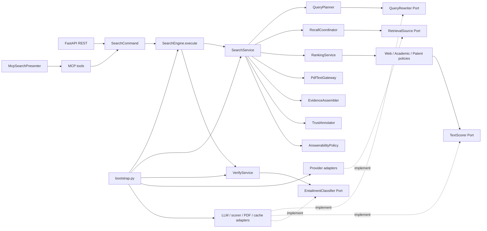

# Agent 搜索引擎架构与渐进式解耦设计

> 状态：结构性解耦基线已建立，F-01 至 F-10 全部完成；当前进入兼容层清理、工程化与运行治理阶段
>
> 当前代码基线：2026-07-17，`2d72487`
>
> 审阅范围：`src/`、`tests/`、`eval/`、`scripts/`、`deploy/` 与直接运行依赖
>
> 验证基线：142 个测试通过；工作树在本次文档更新前干净
>
> 关联文档：[当前技术路线](tech-route-summary.md)、[Trust Layer 设计](agent-search-trust-layer-design.md)、[评测方法](eval-methodology.md)

## 1. 当前结论

仓库已经从“由 Engine 集中编排、共享可变模型和手工接口映射驱动的模块化单体”，演进为具有明确应用层、领域模型、Port、Adapter 和 Composition Root 的模块化单体。现在可以继续进行结构性重构，不再需要先解决阻断性架构问题。

当前已经成立的核心事实：

1. `bootstrap.py` 是唯一运行时 Composition Root，配置读取、外部客户端、线程池和生命周期不再发生在业务模块导入阶段。
2. `SearchEngine` 已从约 1000 行缩减为约 165 行的兼容门面，真实搜索编排位于 `SearchService`。
3. 搜索主链使用 `RetrievedDocument → RankedDocument → EnrichedDocument → Evidence` 的单向阶段转换，缓存和下游步骤不再共享可变候选对象。
4. Provider、查询改写、文本打分、PDF、Entailment、Cache、Clock 和 Deadline 已有显式边界或可注入接口。
5. Ranking 已拆成通用算法、三类领域策略和三个 scorer adapter；生产路径不再依赖旧 `pipeline.rerank`。
6. REST 与 MCP 统一生成 `SearchCommand`，共享 `SearchEngine.execute(command)`，MCP 紧凑响应由版本化 Presenter 维护。
7. `models.py` 已成为兼容 re-export；生产代码按 Search、Evidence、Trust、Failure 和 Response 的所有权导入模型。
8. F-01 至 F-10 的行为、依赖方向和兼容性由 142 个测试保护。

因此后续策略不再是“大规模重写”，而是继续按可独立验证、可独立提交的增量推进。现阶段最大风险已经从模块耦合转移到工程可复现性、质量基线、兼容层生命周期和运行时治理。

本轮仍保持单进程、单部署单元。除非出现明确的容量、故障域或合规需求，不引入微服务。

## 2. 当前架构基线

### 2.1 模块职责

| 模块 | 当前职责 | 当前判断 |
|---|---|---|
| `src/bootstrap.py` | 创建 Settings、HTTP Session、Executor、Cache、Provider、Scorer、Verifier、应用服务、REST/MCP 运行时并统一关闭资源 | 唯一 Composition Root |
| `src/api.py` | FastAPI 路由、鉴权、健康信息、静态页面和 MCP ASGI 挂载 | 仅传输与运行时访问，DTO 已外移 |
| `src/mcp_server.py` | MCP tool schema、Command 映射、线程卸载与 Presenter 调用 | 与 REST 共用应用命令和响应语义 |
| `src/engine.py` | `execute/search/verify/get_pdf_text` 兼容门面和资源关闭协调 | 约 165 行，不再执行搜索业务编排 |
| `src/application/` | 查询规划、召回、排序、PDF 协调、Evidence、Trust、Answerability 与 Verify 用例 | 搜索主链的唯一编排层 |
| `src/application/ports/` | Retrieval、Cache、QueryRewriter、PDF、Entailment、Clock/Deadline 等边界 | 应用层外部依赖接口 |
| `src/domain/` | 不可变阶段文档、Search/Evidence/Trust/Failure 模型和安全错误 | 不依赖 Web 框架、环境或外部 SDK |
| `src/providers/` | 腾讯、百度、SerpAPI、OpenAlex、Patent ES 检索适配器 | 通过 `SourceDescriptor` 声明能力和真实边界 |
| `src/ranking/` | 排序 Port、共享融合算法、领域策略、scorer adapters、工厂和 legacy 包装器 | 生产路径与兼容路径已隔离 |
| `src/pipeline/` | chunk、URL 去重、唯一 RRF、排序选项和旧重排导出 | 只保留小型管线工具与兼容门面 |
| `src/infrastructure/` | Cache、Clock、查询改写、PDF、HTTP 错误映射 | 外部运行机制实现 |
| `src/interfaces/` | REST 输入 schema、公共响应 DTO、MCP Presenter | 请求/响应字段的权威传输契约 |
| `src/trust/` | Provenance/Locator/Quality 标注、Claim 分解、规则与模型 Entailment、Verify 编排 | 子域清晰；模型 adapter 后续仍可物理外移 |
| `src/models.py` | 旧模型导入路径 re-export | 33 行兼容门面，生产代码不再依赖 |
| `src/cache.py` | 旧 Cache 导入路径 re-export | 兼容门面 |
| `eval/` | IR、E2E、Agent 与 MCP 评测 | Tool Agent 已使用 Presenter，其余 Runner 仍有兼容导入待迁移 |

### 2.2 当前依赖与装配方向

依赖方向的当前约束：

- `domain` 不导入 FastAPI、MCP、`requests`、环境变量或供应商 SDK。
- `application` 不读取环境、不创建外部客户端，只消费注入的服务、Port、Clock 和 Executor。
- 具体 Provider、SiliconFlow、本地模型、PDF HTTP 和 Cache 实现只由 `bootstrap` 组装。
- REST/MCP 不逐项调用旧搜索签名，而是转换为 `SearchCommand` 后调用同一用例入口。
- 生产代码不导入 `src.models` 或 `src.pipeline.rerank`；这两个路径只服务兼容调用方。
- 当前有一个有意保留的物理依赖例外：Application 用例直接返回 `interfaces.responses` 中的公共响应 DTO。若后续严格执行“interfaces 只能向内依赖”的 Clean Architecture，可将这些 DTO 移到 `application/contracts.py`，接口层只负责序列化；在没有第二类应用客户端前不强制移动。

### 2.3 搜索主链路

1. REST `SearchRequest` 或 MCP tool 参数经 `search_command_from_mapping` 转为冻结的 `SearchCommand`。
2. `SearchEngine.execute` 只把 Command 委托给 `SearchService.execute`；旧 `SearchEngine.search(...)` 负责兼容参数映射。
3. `RankingService.resolve` 在任何检索 I/O 前校验 Ranking Profile、threshold 和兼容参数冲突。
4. `QueryPlanner` 调用纯规则 L0 完成规范化、时效和领域识别；需要改写时通过注入的 `QueryRewriter` 调用 SiliconFlow adapter。
5. `RecallCoordinator` 按 `SourceRegistry` 和 `SourceDescriptor.kind` 生成 `RetrievalRequest`，并发调用来源；缓存保存冻结的 `RetrievalBatch`。
6. Provider DTO 在召回边界转换为 `RetrievedDocument`，携带 attribution、实际过滤、snapshot、内容类型和来源记录 ID。
7. `RankingService` 为本次调用临时物化兼容 DTO，分别执行 Web、Academic、Patent 策略，并输出新的 `RankedDocument`。
8. `OpenAlexPdfGateway` 在适配器内部处理临时对象，输出 `EnrichedDocument`；不修改排序输入。
9. `EvidenceAssembler` 构造统一 Evidence；`TrustAnnotator` copy-on-write 补充 Provenance、Locator、Quality 和 SearchBoundary。
10. `AnswerabilityPolicy` 基于 Evidence 与结构化 failures 输出可回答性；`SearchService` 组装统一 `SearchResponse`。
11. REST 直接序列化公共响应；MCP 使用 `McpSearchPresenter` 输出 `mcp-search.v1` 紧凑结构。

单个 `Deadline` 从 SearchService 传播到 Recall、Ranking 和 PDF。已完成结果会保留，未开始的 Future 会尝试取消；已经进入阻塞 HTTP 的任务仍依赖 adapter timeout 收敛，这是后续运行治理需要继续解决的边界。

### 2.4 Claim Verification 主链路

1. REST/MCP 输入统一转换为 `CandidateClaim`、Evidence 和可选 SearchBoundary。
2. `VerifyService` 委托 `ClaimVerifier` 分解原子陈述并匹配候选 Evidence。
3. `EntailmentClassifier` 批量判断 supports、contradicts、mentions、unclear 或 irrelevant。
4. 模型失败时回退保守规则分类器，并产生安全、结构化 failure。
5. 一致性检查覆盖实体、数值、单位、时间、否定、版本和辖区，最终输出 ClaimAssessment 与 TrustAssessment。

Trust 业务规则继续以专门的 Trust Layer 设计文档为准，本文件只约束模块边界和运行依赖。

## 3. 已完成问题与架构决策

| 编号 | 原问题 | 已实施结果 | 提交 |
|---|---|---|---|
| F-01 | 排序配置与实际行为不一致 | 统一 `fast/semantic/quality`、`off/prefer/strict` 和兼容冲突校验 | `feebcf6` |
| F-02 | 导入阶段创建全局运行资源 | 冻结 Settings、惰性 app、唯一 Container、共享 Session/Executor 和受管生命周期 | `467f75d` |
| F-03 | `SearchEngine` 职责过载 | 搜索编排拆入 Application，Engine 收敛为兼容门面 | `49de85e` |
| F-04 | 可变对象污染缓存和后续阶段 | 引入冻结阶段文档和单向转换，Trust/PDF copy-on-write | `7a85de8` |
| F-05 | 外部错误泄漏凭证、请求可覆盖模型 | 统一安全错误映射和末端脱敏，禁止外部 backend/model 覆盖 | `24f0778` |
| F-06 | Provider Port 不表达能力和真实边界 | 引入 Descriptor、Request、Batch、Registry、实际过滤和 snapshot | `1d2c3cf` |
| F-07 | Ranking 混合算法、策略、模型适配和旧路径 | 拆分 core/domain/adapters，删除重复 RRF，旧路径变为薄门面 | `20150df` |
| F-08 | 网络、缓存、时钟和执行器散落 | 显式运行时 Port、线程安全缓存/模型缓存、共享 Clock/Deadline/Executor | `fa6511f` |
| F-09 | REST、MCP 和评测契约漂移 | 统一 Command/execute，建立版本化 MCP Presenter 并供 Tool Eval 复用 | `844a16c` |
| F-10 | `models.py` 成为 shared kernel | 按 Search/Evidence/Trust/Failure/Response 拆分，兼容路径只 re-export | `2d72487` |

### 3.1 当前必须保持的行为不变量

- `quality` 是文本相关性和领域信号融合；`semantic` 只使用文本相关性；`fast` 不调用文本模型。
- threshold 始终作用于融合前文本分；scorer 不可用时跳过 threshold，并报告 `THRESHOLD_SKIPPED_NO_SCORER`。
- `strict` 才删除低于阈值的结果；`prefer` 必须允许低分项回填 `top_k`。
- Web RRF 只存在一份语义，候选准备和公开 `rrf_fuse` 必须共享实现。
- Provider、Ranking、PDF 和 Trust 的局部失败不能抹掉其他阶段已经成功的结果。
- 第三方异常、URL 查询参数、Bearer token 和 secret 不得进入公开 failure 或普通日志。
- Ranking、PDF 和 Trust 不得修改调用方传入的阶段对象。
- REST 与 MCP 对同一 Command 的搜索语义必须一致；MCP 的差异只能存在于显式、版本化 Presenter。

## 4. 当前扩展方式

### 4.1 新增普通 Provider

新增 Web/Academic/Patent Provider 时：

1. 实现 `RetrievalSource` 或继承兼容 `SearchProvider`。
2. 声明唯一 `SourceDescriptor`，包括 kind、capabilities、snapshot、license、候选上限和空结果统计策略。
3. 在 `bootstrap.py` 注册到 `SourceRegistry`。
4. 添加 Port contract test，覆盖 success、empty、timeout、认证失败、限流、坏 JSON、字段漂移和 secret leak。

普通 Provider 不应要求修改 SearchService、Trust、REST、MCP 或 Evidence schema。

### 4.2 新增排序后端

1. 在 `ranking/adapters/` 实现 `TextScorer`/`Reranker`。
2. 在 `ranking/factory.py` 注册受信任的部署级 backend。
3. 不在 REST/MCP 暴露任意模型标识。
4. 添加 chunk、顺序、归一化、错误降级和输入不可变测试。

领域权重只进入 `ranking/web.py`、`academic.py` 或 `patent.py`；公共打分算法只进入 `ranking/core.py`。

### 4.3 新增入口或客户端

1. 输入映射为 `SearchCommand`，不复制 SearchService 参数列表。
2. 调用公开 `SearchEngine.execute(command)` 或后续抽出的 `SearchUseCase` Port。
3. 直接消费 `SearchResponse`；如需紧凑格式，新增有版本号的 Presenter 和往返契约测试。
4. 不导入 Engine、Ranking 或 Trust 的下划线私有函数。

### 4.4 新增领域类型

新增普通来源优先复用现有 `web/academic/patent` kind。真正新增领域时，应先引入可注册的 `DomainHandler(kind, ranking_policy, evidence_mapper)`；避免在 SearchService 中继续增加 `if kind == ...` 分支。

## 5. 仍存在的技术债务

### R-01 兼容门面和评测尚未完全退场（优先级：高）

仍保留以下兼容入口：

- `SearchEngine.search(...)`
- `src/models.py`
- `src/pipeline/rerank.py`
- `src/cache.py`
- `src/l0.py` 中查询改写兼容函数
- `ranking/legacy.py` 中 Fusion/Threshold/build_reranker

`eval/run_tool_agent_eval.py` 已迁移到公共 Presenter，但其他 Eval Runner 仍导入 `src.models`；`eval/run_eval.py` 仍使用旧 rerank 兼容路径。删除兼容层前必须先迁移这些调用，并定义至少一个发布周期的 deprecation 窗口。

### R-02 公开配置尚未完成消费审计（优先级：高）

已确认以下 Settings 当前没有进入生产行为：

- `fusion_alpha`、`fusion_beta`、`fusion_gamma`、`fusion_delta` 只被 legacy ranking 接受。
- `openalex_mailto`、`openalex_topic_filter` 只被解析，当前 Provider 未消费。

下一步必须选择“接入并补行为测试”或“废弃并在启动时拒绝/告警”，不能继续静默接受。完成该审计前，Phase 0 的“所有公开配置都有效”退出条件仍未完全满足。

### R-03 质量回归只有行为测试，没有固定检索基线（优先级：高）

当前 142 个测试能够保护排序规则和数据契约，但还没有固定 corpus 的 Recall/NDCG、Evidence 字段和路由 golden baseline。领域权重、Provider 映射或 Evidence 截断调整仍可能在测试全绿时造成质量退化。

需要固定：数据集 hash、git SHA、Settings 指纹、模型、rubric、Provider snapshot、缓存版本和报告格式。

### R-04 构建与 CI 不可复现（优先级：高）

当前 `requirements.txt` 只有六个未锁定依赖，未完整声明 MCP、测试、评测和可选本地 BGE 依赖；仓库没有标准 `pyproject.toml`、锁文件、CI、coverage、lint 或 type-check 配置。

目标 extras：`service`、`mcp`、`local-ranking`、`eval`、`dev`。全新 Python 3.11 环境必须能安装、启动 REST+MCP 并运行测试。

### R-05 运行时治理仍不完整（优先级：中）

已有共享 Session、Executor、per-adapter timeout 和跨阶段 Deadline，但仍缺少：

- 统一重试/指数退避和幂等策略；
- Provider/LLM 级熔断与速率限制；
- request id、阶段耗时、Provider outcome、cache hit、deadline 和降级原因指标；
- 对已经进入阻塞 HTTP 的任务进行协作式取消；
- 外部 LLM 数据分级、敏感字段策略和 egress policy。

### R-06 健康检查与部署验证不足（优先级：中）

当前只有 `/health`，主要报告对象和配置状态，不能区分进程存活与依赖就绪。需要新增：

- `/livez`：只验证进程和事件循环可工作；
- `/readyz`：读取 adapter/circuit 状态，不在每次探活触发付费检索；
- Provider canary、授权 REST、MCP initialize/tools/call 和 SIGTERM 的部署 Smoke。

### R-07 物理目录仍可进一步对齐依赖方向（优先级：低）

逻辑边界已经建立，但 `api.py`、`mcp_server.py`、`providers/` 和部分模型 adapter 仍位于历史顶层路径。可以在兼容调用完成迁移后，再将其物理移动到 `interfaces/rest`、`interfaces/mcp` 和 `infrastructure/providers`。该移动本身不创造解耦价值，优先级低于 R-01 至 R-06。

## 6. 后续重构路线

### Phase A：结构性解耦基线（已完成）

- [x] F-01 至 F-10 全部实施并分别提交。
- [x] 唯一 Composition Root 和受管资源生命周期。
- [x] Application 用例拆分、不可变阶段文档和结构化部分失败。
- [x] Provider 能力/边界、Ranking 策略/Adapter、运行时 Port。
- [x] REST/MCP Command 与 Presenter 契约。
- [x] shared model kernel 拆分和兼容导出。
- [x] 142 个测试通过。

### Phase B：配置与兼容层收敛（下一阶段）

- [ ] 审计全部 Settings 字段，删除或接入无效开关。
- [ ] Eval 全部迁移到公开 Use Case、Client、Presenter 或 Ranking Port。
- [ ] 给 `SearchEngine.search`、`src.models`、`pipeline.rerank` 等兼容入口定义弃用周期。
- [ ] 删除 legacy Fusion/Threshold 构建路径前完成评测迁移。
- [ ] 决定公共 Response DTO 保留在 interfaces，还是移入 application contract 以严格化依赖方向。

退出条件：生产与评测不再依赖兼容门面；所有公开配置均被消费或明确废弃。

### Phase C：工程化与质量基线

- [ ] 建立 `pyproject.toml`、依赖 extras 和可复现锁定方案。
- [ ] 建立 CI：unit、contract、integration、lint、type-check、coverage 和 secret scan。
- [ ] 建立固定 corpus 的路由、排序和 Evidence golden baseline。
- [ ] 评测缓存 key 纳入 git/config/data/model/rubric 指纹。
- [ ] 在全新 Python 3.11 环境运行 REST+MCP Smoke。

退出条件：任意干净环境能复现安装、测试、启动和质量报告；质量下降会阻止合并。

### Phase D：运行治理

- [ ] 增加 `/livez`、`/readyz` 和 Provider canary。
- [ ] 引入统一 retry/backoff、circuit breaker 和 rate limiter。
- [ ] 增加结构化日志、request id、指标和追踪字段。
- [ ] 压测 20–50 个并发请求下的 Executor、Scorer cache、rewrite cache、连接池和内存。
- [ ] 建立外部 LLM 数据分类、脱敏和 egress policy。

退出条件：并发、超时、降级、恢复和资源上限都有可观察、可测试的预算。

## 7. 测试与发布门槛

### 7.1 当前门槛状态

| 门槛 | 当前状态 | 说明 |
|---|---|---|
| 单元/契约回归 | 通过 | 142 个测试通过 |
| 架构依赖测试 | 通过 | 兼容门面、生产导入方向、单一 RRF、模型边界均有测试 |
| 输入不可变和缓存隔离 | 通过 | 阶段文档、排序、PDF、Trust 均有保护 |
| 外部错误脱敏 | 通过 | Provider、PDF、Ranking、Entailment 和 REST failure 有契约测试 |
| REST 请求契约 | 通过 | 鉴权、422、排序冲突和模型覆盖拒绝已覆盖 |
| MCP Presenter 契约 | 通过 | `mcp-search.v1` 往返与未知版本拒绝已覆盖 |
| MCP 真实协议集成 | 部分完成 | 仍需 initialize、tools/list、三类 tool call 和 Host/Origin Smoke |
| 固定检索质量基线 | 未完成 | 尚无 corpus NDCG/Recall/Evidence golden gate |
| Coverage/type/lint | 未完成 | 尚无标准配置和 CI 门槛 |
| 全新环境安装与部署 Smoke | 未完成 | 依赖未完整声明和锁定 |
| 并发与资源预算 | 未完成 | 仅有局部并发/Deadline 测试，尚无系统压测 |

### 7.2 建议合并门槛

- 所有已有测试通过；新增行为必须有对应测试。
- 新增/拆分模块分支覆盖率目标不低于 90%，待 Coverage 基础设施落地后强制执行。
- secret leak 为 0；公开错误只能包含稳定 provider/code/recoverable 信息。
- 必需来源路由覆盖率为 100%。
- 固定 corpus 建立后，NDCG@10 相对基线下降不得超过 0.02；更改领域权重必须附质量报告。
- 新增外部 I/O 必须声明 timeout、Deadline 行为、重试语义、数据出境范围和关闭方式。
- 兼容入口删除必须有调用方扫描、迁移记录和明确弃用窗口。

## 8. 完成定义

结构性解耦已经达到以下条件：

- [x] Application/Domain 不读取环境或创建具体外部客户端。
- [x] Engine 不构造依赖、不执行 Provider/PDF HTTP、不映射三类 Evidence。
- [x] Provider 候选在缓存、排序、富化和 Trust 阶段保持不可变。
- [x] REST/MCP 共享 Command 和公开用例入口。
- [x] Ranking 算法、领域策略和模型 adapter 可独立变化。
- [x] 外部错误经过类型化、脱敏和稳定映射。
- [x] 新增普通 Provider 可通过 Adapter、Descriptor 和注册完成。

整个重构计划尚需达到以下条件：

- [ ] 所有公开 Settings 均有可观察行为或已明确废弃。
- [ ] Eval 不依赖兼容门面或生产私有实现。
- [ ] 公共兼容路径完成弃用并按计划删除。
- [ ] 全新环境可安装并启动完整 REST+MCP 服务。
- [ ] CI 能执行测试、契约、类型、lint、coverage、secret 和部署 Smoke。
- [ ] 固定质量基线和运行时 SLO 能阻止不可接受的回归。
- [ ] 健康检查、日志、指标和外部调用策略满足生产治理要求。

达到上述剩余条件后，仓库才算完成从“可安全重构”到“可持续演进和可生产治理”的完整迁移。
