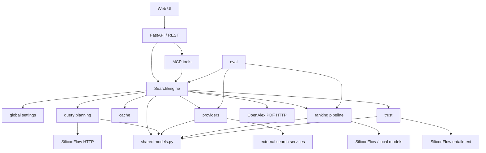
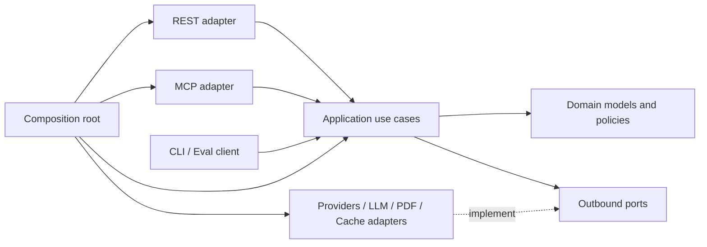

# Agent 搜索引擎架构审阅与解耦设计

> 状态：渐进式重构进行中；F-01 至 F-09 已实施
>
> 审阅基线：2026-07-17，`fa6511f` 加当前 F-09 工作树
>
> 审阅范围：`src/`、`tests/`、`eval/`、`scripts/`、`deploy/` 与直接运行依赖
>
> 验证基线：当前工作树 138 个测试全部通过
>
> 关联文档：[当前技术路线](tech-route-summary.md)、[Trust Layer 设计](agent-search-trust-layer-design.md)、[评测方法](eval-methodology.md)

## 1. 结论

仓库当前是一个可运行的模块化单体：它聚合 Web、学术和专利搜索源，经查询规划、召回、重排、PDF 富化与可信标注后，向 REST 和 MCP 输出统一 Evidence。Provider、Cache、统一 Evidence 以及 Trust 子包已经提供了不错的演进基础。

主要问题不是“模块数量少”，而是模块之间通过全局配置、可变共享对象、字符串约定和手工字段映射形成了隐式耦合。`SearchEngine` 与 `rerank.py` 已成为主要变更热点，REST、MCP 和评测代码也开始出现契约漂移。

建议采用以下方向：

1. 保持单进程、单部署单元，不在本轮引入微服务。
2. 以 `application use case + ports/adapters + composition root` 重整依赖方向。
3. 保留 `SearchEngine` 兼容门面，使用渐进式迁移，避免大爆炸重写。
4. 将 Provider 结果、排序结果和 Evidence 设为不同阶段模型，禁止跨阶段原地修改。
5. REST、MCP、CLI 和评测统一消费同一个 `SearchCommand` 与公开用例接口。
6. 在移动代码前先修正公开配置与真实行为不一致的问题，并建立行为刻画测试。

本设计只定义目标边界和迁移顺序，不改变现有 API 字段、不拆独立服务，也不重新设计 Trust 的业务规则；Trust 规则仍以专门设计文档为准。

## 2. 当前架构

### 2.1 模块职责

| 模块 | 当前职责 | 状态判断 |
|---|---|---|
| `src/api.py` | FastAPI、鉴权、REST DTO、健康检查、静态页面、MCP 挂载 | 传输与装配混合 |
| `src/mcp_server.py` | MCP 工具定义、参数映射、响应投影 | 与 REST 重复维护契约 |
| `src/engine.py` | 装配、缓存、召回、重排、PDF、Evidence、Trust、Answerability | 999 行的核心热点 |
| `src/l0.py` | 规范化、意图识别、时效判断、LLM 改写 | 纯规则与外部 I/O 混合 |
| `src/providers/` | 五类外部检索适配器 | 已有基础 Port，但能力表达不足 |
| `src/pipeline/` | 分块、去重、RRF、文本与领域重排 | `rerank.py` 同时含策略与基础设施 |
| `src/trust/` | Provenance、Locator、Quality、Claim Verification | 子域较清晰，仍依赖共享模型和 URL 工具 |
| `src/models.py` | Provider、Pipeline、Evidence、Trust、API 的所有 Pydantic 模型 | 共享模型巨石 |
| `src/cache.py` | 线程安全的内存 LRU+TTL | 接口清晰，策略仍在 Engine |
| `eval/` | IR、E2E、Agent 与 MCP 评测 | 部分复制生产逻辑并依赖私有函数 |

### 2.2 当前依赖与调用方向



当前搜索主链路是：

1. `POST /search` 或 MCP `search` 将参数逐项传给 `SearchEngine.search`。
2. `plan_query` 规范化查询、判断时效和垂直领域，并可调用 LLM 改写。
3. Engine 建立 `(kind, provider, query)` 元组，在线程池并发召回并应用缓存。
4. Web、Academic、Patent 三路并发执行各自领域重排，失败时局部降级。
5. 学术结果可继续调用 OpenAlex PDF 服务做正文富化。
6. Engine 将三种结果映射为 Evidence，执行 Trust 标注与 Answerability 计算。
7. REST 直接返回 `SearchResponse`；MCP 再手工重组一份响应。

陈述校验主链路已经相对独立：`ClaimVerifier` 依次执行陈述拆分、证据匹配、蕴含分类、一致性检查、独立来源策略和汇总；模型失败时回退到规则分类器。

## 3. 代码审阅发现

### 3.1 已有优势

- `SearchProvider` 和 `CacheBackend` 已建立替换接口，是最适合向 Ports 扩展的起点。
- 三类来源先归一化再进入管线，避免 API 层直接暴露供应商格式。
- `DomainConfig + rerank_domain` 已把领域特征与通用打分框架部分分开。
- Provider、重排和 PDF 失败会进入结构化 `failures[]`，系统具备局部降级能力。
- Trust 已作为独立包存在，并明确区分 relevance、evidence quality 和 claim support。
- 当前测试对领域排序、Evidence、PDF 和 Trust 的核心规则已有较好的行为保护。

### 3.2 P0：重构前必须处理

#### F-01 公开排序配置与执行行为不一致（已解决）

2026-07-17 已将生产排序入口收敛为规范配置 `ranking_profile` 与
`rerank_threshold_mode`，并补充兼容解析和行为测试：

- `quality`（默认）：文本相关性与 Web RRF / 学术元数据 / 专利元数据融合，保持修复前真实生产排序的默认行为。
- `semantic`：启用文本 scorer，但领域辅助特征权重为零。
- `fast`：不调用文本 scorer；Web 使用 RRF，学术和专利使用来源原始分。
- 阈值始终作用于融合前的文本相关性分。`off` 不应用阈值，`prefer`（默认）把达标项置前并用低分项回填到 `top_k`，`strict` 才硬过滤低分项。
- `fast` 或 scorer 降级为 NoOp 时跳过阈值，并返回 `THRESHOLD_SKIPPED_NO_SCORER` 诊断，不把预期降级误报成 partial failure。
- 旧字段继续作为兼容别名：`rerank_enabled=false` 选择 `fast`；非 fast 场景中 `fusion_enabled=true/false` 分别选择 `quality/semantic`。显式新旧配置互相矛盾时拒绝请求，不再静默忽略。

旧的 `FusionReranker` / `ThresholdReranker` 仍供历史评测路径兼容，但生产领域重排只使用上述一条规范路径。后续删除旧实现前，需先迁移 `eval/run_eval.py`。

#### F-02 组合根位于模块导入阶段（已解决）

2026-07-17 已新增唯一组合根 [bootstrap.py](../src/bootstrap.py)，并切断
`import src.api → Settings → Engine → MCP` 的导入副作用链：

- `Settings` 改为冻结配置快照，只能由 `Settings.from_env()` 显式读取环境；`.env` 解析不再修改 `os.environ`，删除模块级 `settings` 单例。
- `src.api:app = create_app()` 只注册路由和固定 MCP 代理。配置解析、Provider/Cache/Scorer/Verifier/Engine/MCP 创建全部延迟到父应用 lifespan。
- `Container` 统一持有并按顺序关闭 Engine、共享 `ThreadPoolExecutor` 与 `requests.Session`；父 lifespan 显式管理 MCP session manager，避免 mounted child 生命周期不执行或重复执行。
- Engine 改为构造器注入配置和资源；请求级 scorer 覆盖也经注入工厂创建。三处临时线程池已统一为共享 executor。
- Provider、MCP、文本 scorer、查询改写、PDF 与 Trust classifier 均使用组合根注入的 HTTP session，不再自行读取环境变量。
- OpenAlex/Patent 启用改为三态语义：显式 `false` 强制关闭，显式 `true` 必须有 URL，未设置时按 URL 自动启用以兼容现有部署。
- 配置错误现在发生在 lifespan 启动阶段；即使数值环境变量损坏，导入 `src.api` 和生成 OpenAPI 仍然安全。

兼容入口 `src.api:app`、`create_app(container)` 与 `SearchEngine.search(...)` 均保留；REST 与 MCP 使用同一 Container，不再共享隐式模块单例。

#### F-03 `SearchEngine` 职责过载（已解决）

2026-07-17 已把原先集中在 [engine.py](../src/engine.py) 的真实搜索链路迁到
`src/application/`，Engine 从约 1000 行降为约 160 行兼容门面：

- 冻结 `SearchCommand` 统一承载旧 `SearchEngine.search(...)` 参数；门面只负责参数映射和用例转发。
- `SearchService` 固定编排 `QueryPlanner → RecallCoordinator → RankingService → PdfTextGateway → EvidenceAssembler → TrustAnnotator → AnswerabilityPolicy`，并集中合并阶段失败与组装 `SearchResponse`。
- `RecallOutcome`、`RankingOutcome`、`PdfEnrichmentOutcome` 等阶段契约冻结为 tuple 边界，调用方只消费显式返回值，为 F-04 的不可变文档模型留出替换点。
- OpenAlex PDF HTTP 已迁到 `infrastructure/openalex_pdf.py` 并实现应用层 `PdfTextGateway` Port；陈述校验由 `VerifyService` 承接。
- 组合根负责装配全部应用服务。Engine 不再导入 `requests`、线程池、具体 Provider、查询规划函数或领域 reranker。
- 旧测试和评测入口不再依赖 `_build_evidence`、`_build_answerability`、`_enrich_academic_pdf_text` 等 Engine 私有函数。

#### F-04 可变对象把缓存、排序和可信判断耦合在一起（已解决）

2026-07-17 已引入 [domain/documents.py](../src/domain/documents.py)，生产主链改为
`RetrievedDocument → RankedDocument → EnrichedDocument → Evidence` 单向转换：

- Provider 的兼容 `SearchResult` 在召回边界立即规范化为冻结的 `RetrievedDocument`；`content_kind`、来源归因、源内排名、源记录 ID、snapshot 与实际查询过滤均成为显式字段。
- `FrozenMap` 递归冻结 metadata、原始载荷、过滤条件与排序特征。召回缓存直接保存不可变 `RetrievalBatch`，命中时可安全共享对象，不再用深复制补偿后续污染。
- Ranking 只把不可变输入物化为本次调用的兼容 DTO，领域重排器也先复制候选；排序输出新的 `RankedDocument(document, score, features)`。跨源归并保留全部 attribution，RRF `_rrf_*` 工作字段只转入只读 features，不进入 raw payload。
- OpenAlex PDF 在适配器内部处理临时副本，并返回独立 `EnrichedDocument`；EvidenceAssembler 不修改阶段输入，内容来源由 `content_kind` 映射，不再由 Provider 名猜测。
- Trust 标注与 Claim Verification 改为 copy-on-write，返回新的 Evidence；调用方传入的 Evidence 保持不变。

旧 `SearchResult.provider_rank/rerank_score/raw` 暂时保留给 Provider、评测与兼容算法，但不再作为生产阶段之间的共享状态。不可变载荷、缓存无污染、RRF 隔离、排序输入不变以及 Trust 输入不变均有契约测试保护。

#### F-05 外部错误可能暴露凭证，模型覆盖缺少约束（已解决）

2026-07-17 已建立统一的外部错误与请求级模型选择边界：

- [domain/errors.py](../src/domain/errors.py) 定义 `ExternalServiceError(provider, code, recoverable)`。其公开 `str/repr` 只包含稳定字段，原始异常仅保留在 `cause` 供受控服务端诊断。
- [infrastructure/http_errors.py](../src/infrastructure/http_errors.py) 将 timeout、401/403、429、5xx、请求拒绝和无效响应映射为稳定错误码；Web Provider、OpenAlex、Patent ES、SiliconFlow 排序与 Entailment 均在适配器边界完成映射。
- `search_failure` 统一消费安全错误；普通异常不再把 `str(exc)` 返回客户端。URL 查询参数、Bearer、token/key/secret 键值另有末端 redaction，PDF 与 Trust 降级路径也使用同一公开消息策略。
- Provider 单条坏数据不再把不可信 payload 通过解析异常打印到普通日志；L0 与 scorer 降级日志只记录稳定 code/backend。
- REST/OpenAPI/UI 已移除 `rerank_backend` 和 `rerank_model` 请求字段；旧客户端继续发送时明确返回 422。外部请求只能选择 allowlist 中的 `fast/semantic/quality` Ranking Profile，具体 backend/model 只能由受信任的部署配置确定。MCP 本来就不暴露模型覆盖。

泄漏 URL 的模拟 HTTP 异常、公开 failure 脱敏、Trust/PDF 降级脱敏和 REST 拒绝请求级模型选择均有契约测试。

### 3.3 P1：建立清晰模块边界

#### F-06 Provider Port 没有表达能力和实际检索边界（已解决）

2026-07-17 已在 [application/ports/retrieval.py](../src/application/ports/retrieval.py)
建立来源无关的检索契约：

- 冻结的 `SourceDescriptor` 声明稳定 id、`web/academic/patent` kind、过滤/内容能力、snapshot 能力、数据许可、语言/辖区、候选上限和空结果统计策略。
- `RetrievalRequest` 显式携带查询、候选预算、recency、UTC `time_from/time_to`、语言与辖区；`RecallCoordinator` 从查询计划生成一次确定的边界并注入 Clock。
- `RetrievalBatch` 返回不可变文档、实际查询、实际过滤、snapshot、限制、耗时和诊断。腾讯、百度、SerpAPI、OpenAlex 与 Patent ES 分别报告自己的原生过滤语义；显式时间边界直接进入腾讯时间戳、OpenAlex 年份和 Patent ES range 请求。
- 现有 Provider 保留 `search()` 供评测兼容，基类 `retrieve()` 将其适配为新 Port 并在适配器边界生成 `RetrievedDocument`。新增 Provider 必须声明 descriptor，无需让应用层识别具体类。
- [source_registry.py](../src/application/source_registry.py) 在 composition root 中按 descriptor 注册来源并拒绝重复 id。`SearchService` 与 `RecallCoordinator` 只按 Registry 和 descriptor.kind 规划、路由、统计、缓存及构造 Trust snapshot，不再持有 academic/patent 专用槽位或按 Provider 名推测能力。

任意 source id 的三领域路由、重复注册、真实过滤映射、显式时间边界下传以及应用层无具体 Provider 分派均有契约测试。

#### F-07 `rerank.py` 混合算法、策略、模型适配与旧路径（已解决）

2026-07-17 已把排序模块按变化原因拆分，并保留旧导入路径作为短期兼容层：

- [ranking/ports.py](../src/ranking/ports.py) 只定义 `Reranker` 稳定接口、NoOp 与分数归一化；[ranking/core.py](../src/ranking/core.py) 承载唯一的领域融合算法和不可变请求上下文。
- Web、Academic、Patent 特征和权重分别位于 [ranking/web.py](../src/ranking/web.py)、[ranking/academic.py](../src/ranking/academic.py) 与 [ranking/patent.py](../src/ranking/patent.py)，不再共享供应商 SDK 或 HTTP 细节。
- FlashRank、BGE 与 SiliconFlow 移到 `ranking/adapters/`；[ranking/factory.py](../src/ranking/factory.py) 是生产组合根使用的唯一文本 scorer 构建路径。
- [fusion.py](../src/pipeline/fusion.py) 的 `rrf_prepare` 成为候选准备和公开 `rrf_fuse` 共用的唯一 RRF 实现；两者共享分数、去重、来源合并和稳定 tie-break 语义。
- 删除 Academic/Web 类中未被生产路径调用的旧压缩、归一化和二次融合辅助实现。旧 `FusionReranker`、`ThresholdReranker` 与 `build_reranker` 隔离在 `ranking/legacy.py`，仅供历史评测迁移。
- [pipeline/rerank.py](../src/pipeline/rerank.py) 已从 1400 余行收敛为无算法的 re-export 门面；`bootstrap` 和 `RankingService` 均直接依赖新模块。

排序行为、输入不可变性与兼容导入由现有领域测试保护；新增架构测试固定薄门面、生产依赖方向和单一 RRF 语义。

#### F-08 网络、缓存、时钟和执行器散落在业务模块（已解决）

F-02 已先行建立共享 HTTP session 和有界 Executor；2026-07-17 在此基础上补齐运行时 Port 与跨阶段预算：

- `QueryRewriter`、`TextScorer`、`PdfTextGateway`、`EntailmentClassifier`、`CacheBackend` 和 `Clock` 均有显式边界；Application 只依赖这些接口或标准 `Executor`。
- [l0.py](../src/l0.py) 只保留规范化、意图识别和路由规则，不再导入 `requests`、持有模块级非线程安全缓存或执行生产网络调用。SiliconFlow 查询改写及兼容函数迁入 [infrastructure/query_rewriter.py](../src/infrastructure/query_rewriter.py)。
- 召回缓存与改写缓存统一使用 [infrastructure/cache.py](../src/infrastructure/cache.py) 的线程安全 LRU+TTL 适配器；过期判断使用注入的 monotonic clock，可确定性测试且不受系统时间回拨影响。
- `SystemClock` 由 composition root 注入 SearchService、Recall、Ranking、PDF 与 ClaimVerifier；搜索耗时、查询时间、时间过滤和新鲜度计算共享同一个请求时间基准。
- RankingService 的动态 scorer cache 使用锁保护，避免并发请求重复加载模型或在关闭/淘汰时竞争。
- 新增部署级 `SEARCH_DEADLINE_MS`。SearchService 创建单一绝对 Deadline 并传播到召回、排序和 PDF；已完成结果正常保留，未开始任务尝试取消并返回稳定的 `SEARCH_DEADLINE_EXCEEDED`，PDF 自身预算也受该绝对上限约束。

Provider、云 scorer、PDF 与 Entailment 中的 `requests` 仅存在于外部适配器；连接池生命周期仍由 Container 统一管理。重试、熔断和结构化运行指标属于 Phase 5 的运行时治理，不再由业务模块自行实现。

#### F-09 REST、MCP 与评测存在契约漂移（已解决）

2026-07-17 已将三个入口收敛到同一请求与响应契约：

- `SearchCommand` 是唯一应用请求模型；[interfaces/schemas.py](../src/interfaces/schemas.py) 的 REST `SearchRequest` 仅负责传输校验，并通过字段过滤器一次性转换为 Command。
- `SearchEngine.execute(command)` 成为 REST、MCP 和进程内客户端共享的公开用例入口；旧 `SearchEngine.search(...)` 只保留参数兼容并委托给 execute。
- MCP 参数通过同一个 `search_command_from_mapping` 转换，旧 `rerank` 显式映射为 `rerank_enabled`；top_k=0、rewrite、PDF timeout、fusion 与 trust 选项和 REST/Command 语义对齐。
- [interfaces/presenters.py](../src/interfaces/presenters.py) 提供版本化 `mcp-search.v1` 紧凑投影，完整携带规范化/改写查询、时效标记、排序配置、warnings、边界、失败和 Evidence；同时可读取迁移前未带版本的投影。
- Tool Agent 评测直接调用 `McpSearchPresenter.restore`，删除手工拼装 `SearchResponse` 的字段复制逻辑。

REST→Command、MCP alias→Command、MCP Presenter 往返、未知版本拒绝和三个入口依赖方向均有契约测试固定。

#### F-10 `models.py` 是全系统 shared kernel

[models.py](../src/models.py) 同时包含 Provider 内部结果、排序工作字段、Evidence、Trust、SearchPlan、错误和 API 响应。几乎所有模块都依赖它，普通字符串状态又允许无效组合在层间流动。

建议按变化原因拆成 `domain/search.py`、`domain/evidence.py`、`domain/trust.py`、`application/commands.py` 和 `interfaces/schemas.py`。内部领域类型可继续使用 Pydantic，但应冻结或只读；传输 DTO 通过 Mapper 与领域类型隔离，并逐步将 kind/status/code 改成 Enum 或 discriminated union。

### 3.4 P2：工程与评测解耦

- `eval/run_agent_scenario_compare.py` 直接导入 `_build_answerability`，多个 Runner 还自行构造 Provider、Ranking 和 `SearchResponse`。评测应依赖 `SearchUseCase` 或版本化 HTTP/MCP Client，实验性单组件评测则依赖公开的 Ranking Port。
- 当前 `requirements.txt` 只有六个未锁版本，未声明直接使用的 MCP 依赖、测试依赖和可选 BGE 依赖；MCP 导入失败会静默变成 REST-only。建议迁移到 `pyproject.toml`，拆分 `service`、`mcp`、`local-ranking`、`eval`、`dev` extras 并提交锁定方案。
- 当前没有 CI、coverage、lint/type 配置。版本库中仅有 27 个已跟踪测试；Trust 的 16 个测试仍在当前未跟踪文件中，合并前必须纳入版本控制。
- `/health` 只展示对象与配置状态，不能证明上游可用。建议拆分 `/livez` 与 `/readyz`，后者读取适配器/circuit 状态，不在每次探活中触发付费搜索。
- 现有评测缓存 key 没有完整包含代码、模型、rubric、配置和数据版本。报告应记录 git SHA、Settings 指纹、数据集 hash、模型与 rubric 版本，避免旧缓存伪装成新结果。

## 4. 目标架构

### 4.1 依赖规则



强制依赖规则如下：

- `domain` 不导入 FastAPI、MCP、`requests`、环境变量或具体 Provider/模型。
- `application` 只依赖 domain 与 Port，不导入具体 adapter 和全局 settings。
- `interfaces` 依赖 application 的用例接口与传输 DTO，不窥探用例内部对象。
- `infrastructure/adapters` 依赖 Port 和 domain，实现外部 I/O。
- `bootstrap` 是唯一允许同时认识接口、应用和基础设施的模块。
- `eval` 不导入下划线私有函数，也不自行复制生产编排。

### 4.2 建议目录

```text
src/
  bootstrap.py
  domain/
    search.py
    evidence.py
    trust.py
    errors.py
    url_identity.py
    ranking/
      core.py
      web.py
      academic.py
      patent.py
  application/
    commands.py
    outcomes.py
    search_service.py
    verify_service.py
    pdf_service.py
    recall.py
    evidence_assembler.py
    answerability.py
    ports/
      retrieval.py
      ranking.py
      rewrite.py
      enrichment.py
      entailment.py
      cache.py
  infrastructure/
    config.py
    http.py
    providers/
    ranking/
    llm/
    openalex_pdf.py
    cache/
  interfaces/
    rest/
      app.py
      schemas.py
    mcp/
      server.py
      presenters.py
```

这是目标职责图，不要求一次性移动全部文件。迁移期允许旧路径作为 re-export 或兼容门面。

### 4.3 核心 Port

```python
class SearchProviderPort(Protocol):
    descriptor: SourceDescriptor
    def retrieve(self, request: RetrievalRequest) -> RetrievalBatch: ...

class TextScorerPort(Protocol):
    name: str
    def score(self, query: str, texts: Sequence[str]) -> Sequence[float]: ...

class PdfTextPort(Protocol):
    def enrich(self, request: PdfEnrichmentRequest) -> PdfEnrichmentOutcome: ...
    def read_page(self, request: PdfPageRequest) -> PdfPageOutcome: ...

class SearchUseCase(Protocol):
    def execute(self, command: SearchCommand) -> SearchResponse: ...
```

所有批处理结果都使用 `Outcome(items, failures, diagnostics)` 表达部分成功；不以第三方异常字符串作为跨层协议。同步 Port 可以先保留，避免在解耦同时改写异步模型；并发、共享执行器与全局 Deadline 由 Application 的 Coordinator 统一控制。

### 4.4 领域扩展方式

新增 Provider 时只应完成三件事：实现 `SearchProviderPort`、声明 `SourceDescriptor`、在 composition root 注册。新增领域时再注册一个 `DomainHandler(kind, rank_policy, evidence_mapper)`。`SearchService`、REST、MCP、Trust 和现有领域实现不应因新增普通 Provider 而修改。

## 5. 渐进式重构计划

### Phase 0：冻结行为与修正契约（进行中；F-01 至 F-05 已完成）

- [x] F-01：统一 Ranking Profile 与 threshold 语义，并补参数解析、排序行为和兼容性测试。
- [x] F-02：引入不可变 Settings、唯一 composition root、惰性应用工厂和受管资源生命周期。
- [x] F-03：拆分搜索应用服务并将 SearchEngine 收敛为兼容门面。
- [x] F-04：引入不可变阶段文档，移除缓存、排序、PDF 与 Trust 的跨阶段对象污染。
- [x] F-05：统一外部错误脱敏，并禁止 REST/MCP 请求级 backend/model 覆盖。
- [ ] 为 REST/MCP 输出差异补测试。
- 修复剩余无效开关。
- 把当前未跟踪的 Trust 测试纳入版本控制。
- 记录一份固定语料的排序和 Evidence golden baseline。

退出条件：所有公开配置均被消费或明确废弃；第三方异常不会向响应和普通日志泄露凭证。

### Phase 1：建立 composition root 与可注入入口

- 引入分组、不可变、启动时一次校验的 Settings。
- 提供 `create_container(settings)`、`create_app(container)` 和 MCP factory。
- Provider、Scorer、Verifier、Cache、Clock、HTTP transport、Executor 全部显式注入。
- 保留 `src.api:app` 和 `SearchEngine.search(...)` 兼容入口。

退出条件：核心测试不再使用 `object.__new__` 绕构造器；导入 domain/application 不会读取 `.env`、加载模型或创建外部客户端。

### Phase 2：拆分 Engine 用例

- [x] 抽出 `EvidenceAssembler`、`AnswerabilityPolicy`、`PdfTextGateway`。
- [x] 抽出 `RecallCoordinator` 与 `RankingService`，统一 Stage Outcome。
- [x] 将 Claim Verification 从 Engine 门面移到 `VerifyService`。
- [x] F-08：引入跨阶段全局 Deadline、取消传播和共享 Clock/Executor。

退出条件：`SearchEngine` 只做兼容委托；每个服务可用 Fake Port 独立测试；部分失败与降级行为保持不变。

### Phase 3：消除可变阶段模型并拆分 Ranking

- [x] 引入 `RetrievedDocument -> RankedDocument -> EnrichedDocument -> Evidence` 单向转换。
- [x] F-06：引入 `SourceDescriptor/RetrievalRequest/RetrievalBatch/SourceRegistry`，在 Provider 适配器边界生成 provenance、实际过滤和 snapshot。
- [x] F-07：拆分 `rerank.py` 的算法、领域策略与模型适配器，删除旧辅助路径和重复 RRF。
- [x] 将 Ranking Profile 与领域策略统一到一条生产构建路径。

退出条件：排序与富化不修改输入；缓存无需为防管线污染而深复制；新增 Web Provider 不改 Engine/Trust。

### Phase 4：统一入口契约与评测边界

- [x] F-09：REST/MCP 共享 Command、Response 和 Mapper。
- [x] 对有意不同的 MCP 紧凑输出建立版本化 Presenter 与 golden test。
- Eval 只调用公开 Use Case/Client；组件实验通过公开 Port 注入策略。
- 将运行依赖、可选 extras、CI、类型检查和覆盖率门槛纳入标准构建。

退出条件：新增请求/响应字段只有一个权威定义；评测不导入生产私有函数；全新 Python 3.11 环境可复现 REST+MCP 服务。

### Phase 5：运行时治理

- 引入全局 Deadline、共享有界 Executor、连接池、重试/退避、熔断与速率限制。
- 增加 request id、阶段耗时、Provider outcome、cache hit 和降级原因等结构化指标。
- 建立 `/livez`、`/readyz` 与真实 Provider canary；外部 LLM 增加数据分级、脱敏与 egress policy。

退出条件：并发、超时和部分失败有明确预算；健康检查、日志和指标不泄露 query 正文、Evidence 或凭证。

## 6. 测试与发布门槛

每个重构阶段至少需要以下保护：

- **纯领域测试**：QueryPlanner、领域排序策略、EvidenceAssembler、Answerability、Trust Policy 使用固定 Clock 和不可变输入。
- **Port 契约测试**：每个 Provider 覆盖 success、empty、401/429、5xx、timeout、坏 JSON、字段漂移，并断言错误中不含 token。
- **Application 集成测试**：Fake Provider/Scorer/PDF 下覆盖乱序完成、部分失败、全失败、重排降级、Deadline 和缓存隔离。
- **接口契约测试**：FastAPI 鉴权与 422/错误映射；MCP initialize、tools/list、三类 tool call、Host/Origin 与鉴权。
- **并发测试**：并发 20–50 个请求时，Scorer/rewrite cache、Executor 和内存使用受限且结果稳定。
- **质量回归**：固定 corpus 的 NDCG/Recall/路由覆盖不得越过事先定义的下降阈值，报告携带完整版本指纹。
- **部署 Smoke**：全新环境安装、服务启动、`/livez`、`/readyz`、授权搜索、MCP 调用和 SIGTERM 优雅退出。

建议首轮门槛为：所有测试通过；新增/拆分模块分支覆盖率不低于 90%；固定排序基线无非预期变化；secret leak 为 0；必需来源路由覆盖为 100%；NDCG@10 相对基线下降不超过 0.02。具体延迟预算应在有代表性的部署环境测量后固定。

## 7. 完成定义

解耦完成不以“文件变多”为标准，而以以下可验证结果为准：

1. 新增普通 Provider 只新增 Adapter 和注册配置。
2. Application/Domain 不导入 `requests`、FastAPI、MCP、环境变量或具体供应商 SDK。
3. REST、MCP 和 Eval 共享一个权威命令/响应契约。
4. `SearchEngine` 不再构造依赖、不执行 PDF HTTP、不映射三类 Evidence。
5. Provider 候选在缓存、重排、富化和 Trust 阶段保持不可变。
6. 所有公开配置均有可观察的行为测试，不存在“接受但不生效”的开关。
7. 外部错误经过类型化、脱敏和稳定映射，客户端不会看到凭证或供应商原始异常。
8. 新鲜环境可安装并启动完整 REST+MCP 服务，CI 能执行单元、契约、集成和部署 Smoke。

达到这些条件后，模块才真正实现了按变化原因解耦；是否将某个 Adapter 独立部署，可以在容量、故障域或合规需求出现后再决定。
